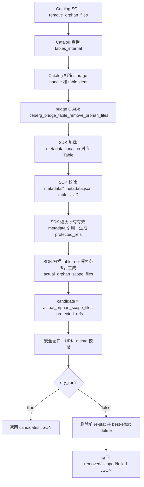
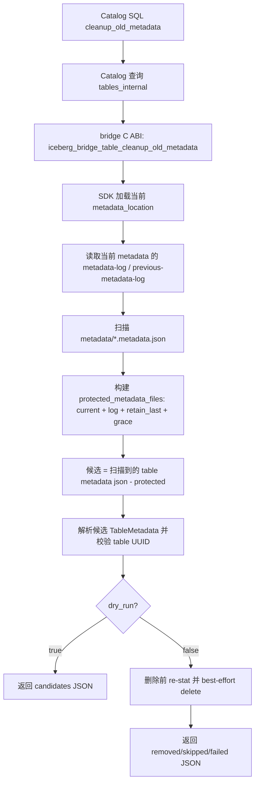
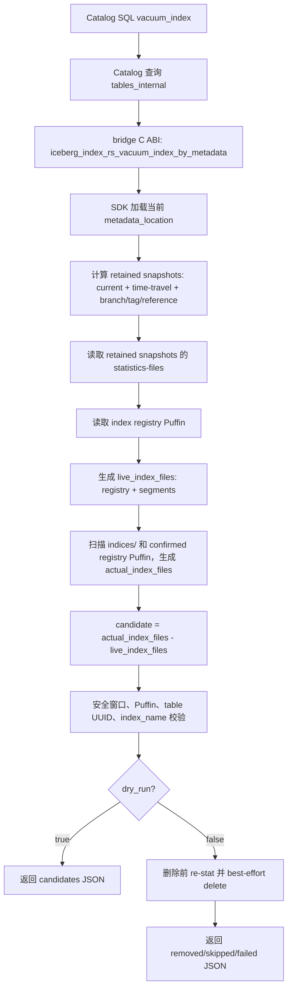

# Iceberg GC 第一阶段：目录扫描型维护接口设计

状态：Draft
日期：2026-07-14
作者：openGauss Iceberg FDW team

> 本文按 DataInfraLab DESIGN_DOC_TEMPLATE.md 重排。附录 A 完整保留原设计正文。

## 1. 动机与背景

第一阶段 GC 为 openGauss Iceberg 集成提供目录扫描型维护能力，处理普通孤儿文件、旧 table metadata JSON 和索引 artifact。FDW 只负责查询与扫描，Catalog 负责 SQL 编排，bridge 提供 C ABI，Rust SDK 或索引引擎负责引用计算、安全校验和物理删除。

这些文件会由失败写入、重复提交、索引重建和 metadata 演进产生。清理过于激进会误删尚未提交的文件、历史 metadata 或仍可用于 time travel 的索引，因此三类文件必须使用不同的保护规则。

## 2. 目标与非目标

### 目标（必须达成的）

1. 提供 remove_orphan_files、cleanup_old_metadata 和 vacuum_index 三个可组合接口。
2. 使用有效引用集合、table UUID、路径范围、文件归属和 older_than 安全窗口避免误删。
3. 支持 dry-run、删除前重新 stat、幂等 NotFound 和文件级失败明细。
4. 不让第一阶段直接修改 metadata pointer 或执行 Catalog CAS。

### 非目标（明确不做的事情）

1. 不生成新的 Iceberg metadata，不更新 tables_internal.metadata_location。
2. 不执行 Catalog CAS，不把三个维护动作合并成一个组合 ABI。
3. 不由通用 orphan 清理删除 index registry 或 segment artifact。
4. 已发布 snapshot 过期后产生的 old_refs - new_refs 差集由第二阶段处理。

## 3. 设计概览

### 架构图

~~~text
Catalog SQL -> tables_internal -> bridge C ABI -> Rust SDK/index engine
            -> 引用集合、路径/UUID/mtime 校验 -> dry-run JSON 或物理删除
~~~

### 组件职责

| 组件 | 职责 | 输入 | 输出 |
|------|------|------|------|
| Catalog | 定位表、解析参数、编排调用 | namespace、table、策略参数 | JSONB、SQL error |
| bridge | FFI 校验、参数转换、错误映射 | storage、metadata_location、table ident | status/result |
| Rust SDK | 引用遍历、目录扫描、UUID/路径/mtime 校验 | metadata、storage config | candidates/removed/skipped/failed |
| index engine | 计算 live index files、校验 Puffin 归属 | metadata、index_name | vacuum JSON |

### 核心数据流

1. Catalog 从 tables_internal 读取当前 metadata_location 和表绑定信息。
2. Catalog 调用对应 bridge ABI；bridge 把参数转给 SDK 或索引引擎。
3. 实现层构造 protected/live/actual 集合，计算 candidate 并进行安全校验。
4. dry-run 返回候选；执行模式删除前 re-stat，再返回结果明细。
5. 无法证明安全的文件必须 fail closed。

## 3.5 详细设计

### 核心数据结构

| 结构 | 字段 | 类型 | 约束 / 不变式 |
|------|------|------|-------------|
| 表绑定 | metadata_location、table_location、table_uuid | URI/string | UUID 不匹配时拒绝删除 |
| 文件集合 | protected/live/actual/candidate | 路径集合 | candidate 仍需通过窗口和归属校验 |
| 请求参数 | dry_run、older_than、retain_last、index_name、verbose | SQL/ABI | 默认 dry_run=true、窗口默认 7 天 |
| 结果 | removed、skipped、failed | JSON 数组 | 文件级失败必须保留 |

### 设计约束 / 不变量（Invariants）

| 约束 | 说明 | 违反后果 |
|------|------|---------|
| current/log 保护 | current、metadata log、previous metadata log 受保护 | 破坏回滚和历史兼容 |
| table UUID | 候选必须属于当前表 | 可能误删其他表文件 |
| 删除前 re-stat | 物理删除前再次获取 mtime | 可能误删正在写入的文件 |
| index 隔离 | vacuum_index 单独处理 registry/segment | 通用 orphan 可能误删索引 |
| fail closed | 无法确认时跳过 | 安全优先、允许残留 |

### 关键算法 / 处理流程

~~~text
remove_orphan_files：
  1. 加载 metadata，收集所有有效 metadata 引用。
  2. 扫描 table root 的受控范围，排除 metadata JSON 和 index artifact。
  3. candidate = actual - referenced。
  4. 检查 URI、路径边界、UUID、mtime 和 older_than。
  5. dry-run 返回候选；执行前 re-stat 后删除。

cleanup_old_metadata：
  1. 扫描 metadata/*.metadata.json。
  2. 保护 current、metadata log、previous metadata log 和 retain_last。
  3. 解析未保护 metadata 并校验 table UUID。
  4. 对超过 older_than 的候选执行删除前 re-stat。

vacuum_index：
  1. 根据 retained snapshot/branch/tag/reference 构造 live_index_files。
  2. 确认 Puffin、UUID 和 index_name 归属。
  3. 计算候选，执行安全窗口与删除前复查。
~~~

### 状态机（如适用）

~~~text
[表记录已定位] -> [metadata 已加载] -> [候选已计算]
       -> [dry-run 返回]
       -> [执行前复查] -> [删除并汇总结果]
~~~

## 4. 关键设计决策

### 决策 1：三个独立维护接口

- **选择**：按普通 orphan、旧 metadata、索引 artifact 拆分接口。
- **理由**：三类文件的引用来源、保护规则和归属校验不同。
- **代价**：Catalog 需要编排多个接口。

### 决策 2：安全窗口与删除前 re-stat

- **选择**：older_than 作为保护窗口，实际删除前再次 stat。
- **理由**：避免把尚未提交或刚写入的文件误判为孤儿。
- **代价**：额外 I/O，部分文件可能被跳过。

### 决策 3：Catalog 持有发布责任

- **选择**：第一阶段不写 metadata pointer、不做 CAS。
- **理由**：维护动作与表状态发布解耦。
- **代价**：调用方必须正确传递当前 metadata_location 和表身份。

## 5. 替代方案（被拒绝的方案列表）

| 方案 | 简述 | 优点 | 缺点 | 为什么拒绝 |
|------|------|------|------|-----------|
| 单一 gc 接口 | 一个接口处理所有文件类型 | 调用简单 | 保护规则混杂 | 不利于独立审计和组合 |
| 只看当前 metadata | 仅比较当前 snapshot 引用 | 实现简单 | 会误删历史引用 | 不满足 time travel |
| 不设置 grace period | 未引用即删除 | 清理及时 | 误删尚未提交文件 | 安全性不可接受 |
| Catalog 直接删除对象 | SQL 层直接删文件 | 路径直观 | 绕过校验 | 破坏分层边界 |

## 6. 接口 / 配置面

### API / Trait

~~~sql
remove_orphan_files(p_namespace text, p_table text,
  older_than interval default interval '7 days',
  dry_run boolean default true, verbose boolean default false) returns jsonb;

cleanup_old_metadata(p_namespace text, p_table text,
  older_than interval default interval '7 days',
  retain_last integer default 100,
  dry_run boolean default true, verbose boolean default false) returns jsonb;

vacuum_index(p_namespace text, p_table text, index_name text default null,
  older_than interval default interval '7 days',
  dry_run boolean default true, verbose boolean default false) returns jsonb;
~~~

### 配置项

| 字段 | 类型 | 默认值 | 必填 | 说明 |
|------|------|--------|------|------|
| older_than | interval | 7 days | 否 | mtime 必须早于 now - older_than |
| dry_run | boolean | true | 否 | 只计算候选，不删除 |
| retain_last | integer | 100 | 否 | 旧 metadata 额外保留数量，必须为正 |
| index_name | text | NULL | 否 | NULL 表示全表索引 |
| verbose | boolean | false | 否 | 返回详细集合 |

## 6.5 关键场景

### 场景 1：普通孤儿文件

- **触发**：失败写入留下超过安全窗口的文件。
- **流程**：收集引用全集、扫描目录、计算差集、复查 mtime 后删除。
- **预期**：窗口内和已引用文件保留。
- **涉及接口**：remove_orphan_files。

### 场景 2：旧 metadata

- **触发**：多次提交产生旧 metadata JSON。
- **流程**：保护 current/log/previous/retain_last，解析并校验其余 metadata。
- **预期**：只删除属于当前表且超过安全窗口的 metadata。
- **涉及接口**：cleanup_old_metadata。

### 场景 3：索引 vacuum

- **触发**：索引 drop/rebuild 或失败留下旧 registry/segment。
- **流程**：计算 live set，确认 Puffin 和 index 归属后删除候选。
- **预期**：历史可达索引保留，归属不明文件跳过。
- **涉及接口**：vacuum_index。

## 7. 错误处理与降级

- 请求或句柄校验失败返回 InvalidArgument/SQL ERROR。
- metadata、UUID、Puffin、路径或 mtime 无法确认时 fail closed。
- NotFound 按幂等成功处理并记录原因。
- 单文件删除失败写入 failed，不影响其他候选处理。
- SDK/存储不可用时不删除文件，返回对应错误。
- dry-run 不产生物理副作用。

## 8. 测试策略

- **单元测试**：路径规范化、引用集合、UUID、Puffin/index 归属、mtime、retain_last。
- **集成测试**：memory/fs/S3 storage、三类 bridge ABI 和 capabilities。
- **错误路径测试**：空参数、无效 URI、UUID mismatch、未知 mtime、NotFound、删除失败。
- **端到端测试**：Catalog SQL 验证 dry-run、真实删除边界、返回 JSON 和幂等行为。
- **性能 / 压测**：大目录扫描和删除前 re-stat 的成本建立基线。

## 9. 风险与未决问题

### 已知风险

| 风险 | 影响 | 缓解措施 |
|------|------|---------|
| mtime 缺失 | 误删风险上升 | 缺失时跳过，删除前 re-stat |
| 表路径重叠 | 可能扫描其他表文件 | 建表约束、UUID 和路径边界 |
| 索引归属不明 | 误删 registry/segment | Puffin、UUID、index_name 多重确认 |
| 大目录扫描 | 延迟和存储 API 成本 | 受控范围、dry-run、性能基线 |

### 未决问题（设计完成前必须回答的）

#### 问题 A：table_location 唯一性

- **背景**：create_table 校验仍有 TODO。
- **决定**：维护入口校验 table UUID 和路径边界。
- **剩余风险**：历史脏数据可能需要人工处理。

#### 问题 B：索引 registry Puffin 识别

- **背景**：普通 statistics Puffin 与索引 registry 可能共存。
- **决定**：无法证明归属时跳过。
- **剩余风险**：索引构建流程需提供稳定 blob type、UUID 和归属信息。

## 9.5 与参考实现的差异

| 方面 | 参考实现 | 本设计 | 偏离理由 |
|------|---------|--------|---------|
| orphan cleanup | Iceberg remove_orphan_files | 独立 bridge/SDK 接口 | 适配 Catalog/FDW 分层 |
| metadata cleanup | Iceberg writer properties | 独立 cleanup_old_metadata | 支持显式窗口和审计 |
| index cleanup | LanceDB optimize | 独立 vacuum_index | 隔离自定义 index artifact |
| snapshot expiration | Iceberg expire_snapshots | 第一阶段不重写 metadata | 由第二阶段处理 |

## 10. 相关文档

- iceberg-gc-phase2-expire-snapshots-design.md
- iceberg-fdw-managed-fullscan-implementation-design.md
- iceberg-fdw-index-scan-implementation-design.md
- DataInfraLab DESIGN_DOC_TEMPLATE.md

## 11. 冻结后的增量维护（Frozen Document Maintenance）

本文当前为 Draft。进入 Frozen 后，按模板规定通过 SPEC Delta、ADR 和 TEST_PLAN 增量维护，不直接修改冻结正文。

## 附录 A：原设计正文（完整保留）

# Iceberg GC 第一阶段：目录扫描型维护接口设计

## 1. 背景

openGauss Iceberg 集成通过 ``iceberg_catalog.tables_internal`.metadata_location` 管理 Iceberg 表的当前
metadata pointer。FDW 只负责查询和扫描，不参与表维护命令。GC / 维护入口统一放在
`iceberg_catalog` 扩展中，由 Catalog SQL 函数同步调用 bridge C ABI，再由 bridge 调用 Rust SDK。

Iceberg 表在正常查询路径中只通过 metadata 引用文件；对象存储中的物理文件并不会因为失去引用而自动删除。
以下场景会产生需要维护接口清理的残留文件：

- 写入任务已经写出 data/delete 文件、manifest、manifest-list 或 statistics 文件，但在提交 metadata 前失败、
  取消或进程崩溃。这些文件从未进入任何已发布 metadata 的引用链，只能通过目录扫描发现。
- 多次提交、索引发布或表属性变更会产生新的 table metadata json。旧 metadata json 需要按 metadata log、
  current pointer 和 `retain_last` 规则保留，不能与普通 data orphan 文件用同一套判断规则处理。
- index drop/rebuild 或索引构建失败可能留下 index registry Puffin 和 index segment artifact。索引文件需要保留
  历史 snapshot / branch / tag / reference 可达性，不能由通用 orphan cleanup 根据“当前 metadata 不引用”直接删除。

这些残留文件的安全判断依据不同：普通孤儿文件看 Iceberg metadata 引用全集和安全窗口；旧 table metadata json 看
current pointer、metadata log、previous metadata log 和 `retain_last`；索引文件看 retained snapshot / branch / tag /
reference 可达的 index registry 与 segment artifact。如果放在一个通用清理接口中实现，调用方很难表达清理意图，
实现层也容易把 metadata 保留策略、普通 orphan 差集和索引历史可达性混在一起，增加错删风险。因此第一阶段按文件归属
和保护规则拆成三个独立接口：

- `remove_orphan_files` 清理从未被任何有效 metadata 引用、或已经不被任何有效 metadata 引用且满足安全窗口的普通孤儿文件，
  覆盖 data/delete、manifest、manifest-list 和 Iceberg statistics orphan。
- `cleanup_old_metadata` 只清理旧 table metadata json。它保护 current metadata、metadata log、previous metadata log
  和最近 `retain_last` 个 metadata json，避免误删仍可用于回滚、诊断或历史兼容的 metadata。
- `vacuum_index` 只清理本项目索引体系的 registry Puffin 和 segment artifact。它基于 retained snapshot / branch / tag /
  reference 可达性计算 `live_index_files`，并在删除前做 Puffin、table UUID 和 `index_name` 归属校验。

这三个接口都属于第一阶段，是因为它们只做“目录扫描 + 引用集合比对 + 安全校验 + 物理删除”。它们不会生成新的
Iceberg metadata，不会更新 `tables_internal.metadata_location`，也不会执行 Catalog CAS。需要改写 metadata、发布新
metadata pointer 或组合多个维护动作的能力放到第二阶段 `expire_snapshots` 和 Catalog orchestration 中实现。

Iceberg 原生维护中，`expire_snapshots` 用于过期 snapshot 并删除只被过期 snapshot 独占引用的 data/delete、
manifest、manifest-list、statistics 文件；`remove_orphan_files` 用于清理不被 metadata 引用的孤儿文件，且官方提醒
retention 过短会误删尚未提交的写入文件。LanceDB OSS 倾向于用 `optimize()` 组合 compaction、cleanup 和索引维护。
本项目第一阶段采用 Iceberg 的独立动作语义，先提供可组合的底层维护能力。

## 2. 接口规格、约束与设计边界

### 2.1 对外 SQL 接口规格

| 接口 | 参数 | 类型 / 默认值 | 含义 | 返回 |
| --- | --- | --- | --- | --- |
| `remove_orphan_files` | `p_namespace` | `text`，必填 | Catalog namespace | `jsonb` |
|  | `p_table` | `text`，必填 | Catalog table name |  |
|  | `older_than` | `interval DEFAULT interval '7 days'` | 候选文件 mtime 必须早于 `now - older_than` |  |
|  | `dry_run` | `boolean DEFAULT true` | true 只返回候选；false 执行删除 |  |
|  | `verbose` | `boolean DEFAULT false` | true 返回候选、删除、跳过明细 |  |
| `cleanup_old_metadata` | `p_namespace` | `text`，必填 | Catalog namespace | `jsonb` |
|  | `p_table` | `text`，必填 | Catalog table name |  |
|  | `older_than` | `interval DEFAULT interval '7 days'` | 候选 metadata json mtime 必须早于安全窗口 |  |
|  | `retain_last` | `integer DEFAULT 100` | 除 current/log 保护外，额外保留最近 N 个 table metadata json；必须为正整数 |  |
|  | `dry_run` | `boolean DEFAULT true` | true 只返回候选；false 执行删除 |  |
|  | `verbose` | `boolean DEFAULT false` | true 返回明细 |  |
| `vacuum_index` | `p_namespace` | `text`，必填 | Catalog namespace | `jsonb` |
|  | `p_table` | `text`，必填 | Catalog table name |  |
|  | `index_name` | `text DEFAULT NULL` | NULL 表示清理全表索引；非 NULL 时只清理可证明属于该 index 的文件 |  |
|  | `older_than` | `interval DEFAULT interval '7 days'` | 候选 index 文件 mtime 必须早于安全窗口 |  |
|  | `dry_run` | `boolean DEFAULT true` | true 只返回候选；false 执行删除 |  |
|  | `verbose` | `boolean DEFAULT false` | true 返回明细 |  |

所有接口使用 `p_namespace` / `p_table` 定位 ``iceberg_catalog.tables_internal`` 记录，不要求调用方传 `regclass`。

### 2.2 对外行为约束

- 默认 `dry_run=true`。
- 默认安全窗口为 7 天。
- 请求级错误抛 SQL ERROR 或 C ABI error；文件级删除失败保存在返回 JSON 的 `failed` 中。

### 2.3 用户定义约束

用户和 Catalog 建表逻辑必须保证：

- 不同 Iceberg 表的 `table_location` 不能完全相同。
- 不同 Iceberg 表的 `table_location` 不能存在父子包含关系。
- 表的 storage config 必须能同时被扫描、维护和索引 SDK 正确解析。

当前实现如果尚未在 `create_table` 阶段强制校验 table_location 唯一性，也必须在维护入口通过 table UUID 和路径规则 fail closed，不能猜测删除。

### 2.4 内部实现约束

- 删除前必须重新 `stat` 候选文件并复查安全窗口。
- mtime 缺失、路径越界、URI 无法规范化、table UUID 不匹配、Puffin 归属不明时不得删除。
- NotFound 按幂等成功处理，但明细中记录 `reason=not_found`。
- 所有路径比较必须解析 URI 后分别比较 scheme、authority/bucket 和 normalized path，不能只做字符串前缀匹配。

### 2.5 删除范围约束

| 文件类型 | 第一阶段处理接口 | 说明 |
| --- | --- | --- |
| 未被任何有效 metadata 引用的 data/delete、manifest、manifest-list、Iceberg statistics 文件 | `remove_orphan_files` | 扫描 table root 的受控范围；排除 table metadata json 和 index artifact |
| 旧 table metadata json | `cleanup_old_metadata` | 只处理 `{table_location}/metadata/*.metadata.json` |
| index registry Puffin / index segment artifact | `vacuum_index` | 保护 retained snapshot / reference 可达索引 |
| manifest / manifest-list | `remove_orphan_files` 或第二阶段 `expire_snapshots` | 从未被发布 metadata 引用的孤儿文件由 `remove_orphan_files` 清理；曾被过期 snapshot 引用的由 `expire_snapshots` 清理 |
| Iceberg 原生 statistics Puffin | `remove_orphan_files` 或第二阶段 `expire_snapshots` | 不被任何有效 metadata 引用的由 `remove_orphan_files` 清理；被过期 snapshot 独占引用的由 `expire_snapshots` 清理 |

manifest 和 manifest-list 的清理归属分两类：已经进入已发布 metadata 引用链、后来因 snapshot 过期不再被引用的文件，
由第二阶段 `delete_expired_snapshot_files` 基于 `old_refs - new_refs` 清理；从未进入任何已发布 metadata 引用链的
孤儿 manifest / manifest-list，`expire_snapshots` 看不到，必须由第一阶段 `remove_orphan_files` 通过目录扫描和有效
引用全集比对清理。第一阶段删除这类文件时必须依赖安全窗口、路径范围、table UUID、有效引用全集和删除前 re-stat，
避免误删正在写入但尚未提交的文件。

### 2.6 Iceberg / LanceDB 对比

| 能力 | Iceberg 原生行为 | LanceDB 行为 | 本项目第一阶段 |
| --- | --- | --- | --- |
| orphan 文件清理 | `remove_orphan_files` 清理不被 metadata 引用且超过 retention 的文件；可覆盖 data、metadata、manifest 等 table location 下文件；retention 过短有误删风险 | `optimize()` 的 cleanup 会清理旧版本文件 | 独立 `remove_orphan_files`，默认 7 天，覆盖 data/delete、manifest、manifest-list、Iceberg statistics orphan |
| 旧 metadata json | 可用 `write.metadata.delete-after-commit.enabled` 和 `write.metadata.previous-versions-max` 控制；未跟踪 metadata 也可被 orphan deletion 清理 | 旧版本由 cleanup/optimize 清理 | 独立 `cleanup_old_metadata`，默认 `retain_last=100`，用户可传参 |
| manifest / manifest-list | `expire_snapshots` 删除过期 snapshot 独占引用的 manifest / manifest-list；`remove_orphan_files` 清理从未被 metadata 引用的孤儿文件 | cleanup 由 optimize 组合完成 | orphan manifest / manifest-list 由第一阶段清理；过期 snapshot 引用差集由第二阶段清理 |
| index 文件 | Iceberg 无本项目自定义 index registry / segment | optimize 会组合索引维护 | 独立 `vacuum_index`，保护历史 snapshot 查询 |
| 组合入口 | Spark procedures 多为独立动作 | `optimize()` 是组合入口 | 放到第二阶段 Catalog 组合入口中 |

## 3. 术语

- `metadata_location`：Catalog 记录的当前 Iceberg metadata json URI，是本项目唯一的表状态入口。
- `table_location`：Iceberg table root URI。
- `安全窗口`：文件最后修改时间必须早于 `now - older_than`；默认 7 天。
- `protected set`：必须保留的文件集合，例如 current metadata、metadata log、最近 `retain_last` 个 metadata json。
- `live set`：仍被有效表状态引用的文件集合，通常用于 index vacuum；`live_index_files` 表示 retained snapshot / reference 可达 registry 中仍引用的 index 文件。
- `actual set`：对象存储目录扫描得到的实际文件集合。
- `actual_index_files`：`vacuum_index` 使用的实际索引文件集合。它只包含两类文件：一类是从 `{table_location}/indices/` 目录扫描到、并经过路径边界和索引归属校验的索引物理文件；另一类是从当前表 metadata 可达的 `statistics-files` 中解析并确认属于本项目 index registry 的 Puffin 文件。它不是“表目录下所有 `.puffin` 文件”的集合。
- `confirmed registry Puffin`：已经被当前表 metadata 的 `statistics-files` 引用，并且通过 Puffin 内容或 blob metadata 校验证明是本项目 index registry 的 Puffin 文件。确认条件至少包括：文件路径在当前 `table_location` 内、Puffin 可解析、包含本项目约定的 index registry blob type、table UUID 与当前表一致；当传入 `index_name` 时，还必须能证明 registry 属于该索引或引用该索引。普通 Iceberg statistics Puffin、无法解析的 Puffin、table UUID 不匹配的 Puffin、索引归属不明的 Puffin 都不能作为 confirmed registry Puffin。
- `candidate set`：`actual set - protected/live set` 后得到的候选集合，仍必须经过安全窗口和归属校验。
- `retained snapshot`：不会被过期或仍需支持 time travel / branch / tag / reference 查询的 snapshot。
- `unknown metadata json`：扫描 `{table_location}/metadata/` 后发现、且不在 `protected_metadata_files` 中的 `*.metadata.json` 文件。它可能是旧版本、失败写出的未发布 metadata、其他表误放文件或损坏文件，必须解析并校验 table UUID 后才能进入候选集合。
- `fail closed`：无法证明安全时拒绝或跳过，不猜测删除。

## 4. 具体使用场景

### 4.1 remove_orphan_files 场景

表 `db.events` 当前 metadata 为 `metadata/v0005.metadata.json`，当前和历史有效 metadata 引用：

```text
s3://lake/db/events/metadata/v0005.metadata.json
s3://lake/db/events/metadata/snap-1005.avro
s3://lake/db/events/metadata/manifests/m-1005.avro
s3://lake/db/events/data/2026-06-01/a.parquet
s3://lake/db/events/data/2026-06-02/b.parquet
s3://lake/db/events/data/delete/d1.parquet
```

对象存储实际文件：

```text
s3://lake/db/events/data/2026-06-01/a.parquet              # referenced, keep
s3://lake/db/events/data/2026-06-02/b.parquet              # referenced, keep
s3://lake/db/events/data/delete/d1.parquet                 # referenced delete file, keep
s3://lake/db/events/data/tmp/job-1.parquet                 # unreferenced, mtime 10 days ago, delete
s3://lake/db/events/data/tmp/job-2.parquet                 # unreferenced, mtime 2 hours ago, skip
s3://lake/db/events/metadata/orphan-snap.avro              # unreferenced manifest-list, mtime 12 days ago, delete
s3://lake/db/events/metadata/manifests/orphan-m.avro       # unreferenced manifest, mtime 12 days ago, delete
s3://lake/db/events/metadata/manifests/new-m.avro          # unreferenced manifest, mtime 10 minutes ago, skip
s3://lake/db/events/metadata/v0003.metadata.json           # table metadata json, protected by cleanup_old_metadata, ignore
s3://lake/db/events/indices/idx-1/seg-1.puffin             # index artifact, ignore
```

调用：

```sql
SELECT iceberg_catalog.remove_orphan_files(
    p_namespace => 'db',
    p_table => 'events',
    older_than => interval '7 days',
    dry_run => false,
    verbose => true
);
```

结果边界：

- 删除 `data/tmp/job-1.parquet`、`metadata/orphan-snap.avro` 和 `metadata/manifests/orphan-m.avro`。
- 跳过 `data/tmp/job-2.parquet` 和 `metadata/manifests/new-m.avro`，原因是安全窗口内。
- 保留所有 referenced files。
- 不删除 table metadata json；不处理 index artifact。

返回示例：

```json
{
  "operation": "remove_orphan_files",
  "dry_run": false,
  "scope": "table_orphan_files",
  "table": "db.events",
  "base_metadata_location": "s3://lake/db/events/metadata/v0005.metadata.json",
  "new_metadata_location": null,
  "candidate_file_count": 3,
  "deleted_file_count": 3,
  "skipped_file_count": 2,
  "failed_file_count": 0,
  "removed": [
    {"path": "s3://lake/db/events/data/tmp/job-1.parquet", "size": 1024},
    {"path": "s3://lake/db/events/metadata/orphan-snap.avro", "size": 2048},
    {"path": "s3://lake/db/events/metadata/manifests/orphan-m.avro", "size": 2048}
  ],
  "skipped": [
    {"path": "s3://lake/db/events/data/tmp/job-2.parquet", "reason": "within_grace_period"},
    {"path": "s3://lake/db/events/metadata/manifests/new-m.avro", "reason": "within_grace_period"}
  ],
  "failed": []
}
```

### 4.2 cleanup_old_metadata 场景

当前 metadata 为 `v0005.metadata.json`。metadata log 保护 `v0004.metadata.json` 和 `v0003.metadata.json`。
调用方传 `retain_last => 2`，因此最近两个版本 `v0005`、`v0004` 也受保护。

对象存储实际文件：

```text
metadata/v0005.metadata.json       # current, keep
metadata/v0004.metadata.json       # metadata log + retain_last, keep
metadata/v0003.metadata.json       # metadata log, keep
metadata/v0002.metadata.json       # old, UUID matches, mtime 20 days ago, delete
metadata/v0001.metadata.json       # old, mtime 1 day ago, skip
metadata/failed-write.metadata.json # not protected, parse fails, skip
metadata/manifest-list-1.avro       # not table metadata json, ignore
```

调用：

```sql
SELECT iceberg_catalog.cleanup_old_metadata(
    p_namespace => 'db',
    p_table => 'events',
    older_than => interval '7 days',
    retain_last => 2,
    dry_run => false,
    verbose => true
);
```

返回示例：

```json
{
  "operation": "cleanup_old_metadata",
  "dry_run": false,
  "scope": "table_metadata_json_only",
  "retain_last": 2,
  "candidate_file_count": 1,
  "deleted_file_count": 1,
  "skipped_file_count": 2,
  "removed": [
    {"path": "s3://lake/db/events/metadata/v0002.metadata.json", "size": 4096}
  ],
  "skipped": [
    {"path": "s3://lake/db/events/metadata/v0001.metadata.json", "reason": "within_grace_period"},
    {"path": "s3://lake/db/events/metadata/failed-write.metadata.json", "reason": "metadata_parse_failed"}
  ],
  "failed": []
}
```

### 4.3 vacuum_index 场景

当前 retained snapshots 为 `1003`、`1004`，它们的 statistics-files 指向 registry：

```text
indices/index-metadata-1003-live.puffin
indices/index-metadata-1004-live.puffin
```

registry 中 live segment：

```text
indices/vec_idx/snap1003/seg-a.puffin
indices/vec_idx/snap1004/seg-b.puffin
```

对象存储实际文件：

```text
indices/index-metadata-1004-live.puffin       # live registry, keep
indices/vec_idx/snap1004/seg-b.puffin         # live segment, keep
indices/vec_idx/dropped/seg-old.puffin        # not live, mtime 30 days ago, delete
indices/vec_idx/building/seg-new.puffin       # not live, mtime 1 hour ago, skip
indices/other_idx/orphan.puffin               # index_name=vec_idx 时归属不明或不匹配, skip
```

调用：

```sql
SELECT iceberg_catalog.vacuum_index(
    p_namespace => 'db',
    p_table => 'events',
    index_name => 'vec_idx',
    older_than => interval '7 days',
    dry_run => false,
    verbose => true
);
```

返回示例：

```json
{
  "operation": "vacuum_index",
  "dry_run": false,
  "scope": "index_files",
  "index_name": "vec_idx",
  "live_file_count": 4,
  "actual_file_count": 5,
  "candidate_file_count": 1,
  "deleted_file_count": 1,
  "skipped_file_count": 2,
  "removed": [
    {"path": "s3://lake/db/events/indices/vec_idx/dropped/seg-old.puffin", "size": 8192}
  ],
  "skipped": [
    {"path": "s3://lake/db/events/indices/vec_idx/building/seg-new.puffin", "reason": "within_grace_period"},
    {"path": "s3://lake/db/events/indices/other_idx/orphan.puffin", "reason": "index_name_mismatch_or_unknown_owner"}
  ],
  "failed": []
}
```

## 5. 端到端链路

### 5.1 remove_orphan_files 流程



该接口的 protected 依据来自当前 metadata 中所有有效 metadata 文件引用集合，包括 snapshot、manifest-list、manifest、
data/delete files、statistics files 和当前 table metadata/log。扫描范围是 table root 的受控子目录，必须显式排除
index artifact 和 table metadata json 删除逻辑。

### 5.2 cleanup_old_metadata 流程



metadata log / previous metadata log 从当前 `metadata_location` 指向的 Iceberg `TableMetadata` 内容中读取；不是从
Catalog 表读取。

### 5.3 vacuum_index 流程



retained snapshot 的作用不是“生成 registry”，而是确定哪些历史 snapshot 仍可被查询或回滚。SDK 需要读取这些 snapshot
可达的 registry，从 registry 中标记必须保留的 registry Puffin 和 segment artifact，形成 `live_index_files`。

## 6. 接口与实现细节

### 6.1 remove_orphan_files

Catalog SQL 实现：

```sql
SELECT iceberg_catalog.remove_orphan_files(
    p_namespace text,
    p_table text,
    older_than interval DEFAULT interval '7 days',
    dry_run boolean DEFAULT true,
    verbose boolean DEFAULT false
) RETURNS jsonb;
```

处理顺序：

1. 校验 p_namespace、p_table 非空，older_than 大于 0。
2. 从 ``iceberg_catalog.tables_internal`` 按 namespace/table 查表，读取 `table_uuid`、`metadata_location`、`table_location`、`current_snapshot_id`。
3. 根据 Catalog 中保存的 storage 配置打开 bridge storage handle；默认扫描 table root 的受控范围，不要求用户传 `location`。
4. 构造 `IcebergBridgeTableIdent`，把 `older_than` 转换为 `grace_period_seconds`。
5. 调用 `iceberg_bridge_table_remove_orphan_files`。
6. bridge 返回成功时，将 JSON 字符串转成 `jsonb` 返回；bridge 返回请求级错误时抛 SQL ERROR。
7. Catalog 不解析 manifest，不扫描对象存储，不做物理删除；文件级失败只透传在 JSON 中。

bridge C ABI：

```c
IcebergBridgeStatus iceberg_bridge_table_remove_orphan_files(
    IcebergBridgeStorage *storage,
    const char *metadata_location,
    const IcebergBridgeTableIdent *table_ident,
    bool dry_run,
    uint64_t grace_period_seconds,
    IcebergBridgeString **out,
    IcebergBridgeError **err);
```

SDK 接口：

```rust
pub async fn remove_orphan_files(
    config_json: &str,
    file_io: &FileIO,
    table: &Table,
    metadata_location: &str,
    dry_run: bool,
    grace_period_seconds: u64,
) -> Result<Value>;
```

实现要求：

- 防误删核心规则是“引用全集 + 安全窗口 + 删除前复查”：先从当前有效 metadata 构建完整 protected refs，再扫描 table root 中允许的 orphan scope；新写入但尚未提交的 manifest/data 文件通常会落在 7 天安全窗口内，必须跳过；即使超过窗口，若路径、类型或 table 归属无法确认，也必须跳过。
- 收集当前有效 metadata 引用的所有受保护文件，包括 table metadata/log、snapshot manifest-list、manifest、data/delete files 和 Iceberg statistics files。
- 扫描 table root 的受控范围，覆盖 `data/` 和 orphan manifest / manifest-list / Iceberg statistics 文件所在目录。
- `actual_orphan_scope_files - protected_refs` 后再做安全窗口和 URI 校验。
- 不重新加载最新 metadata；依赖 7 天安全窗口和删除前 re-stat 保护并发写入。

### 6.2 cleanup_old_metadata

Catalog SQL 实现：

`sql
SELECT iceberg_catalog.cleanup_old_metadata(
    p_namespace text,
    p_table text,
    older_than interval DEFAULT interval '7 days',
    retain_last integer DEFAULT 100,
    dry_run boolean DEFAULT true,
    verbose boolean DEFAULT false
) RETURNS jsonb;
`

处理顺序：

1. 校验 p_namespace、p_table 非空，older_than 大于 0，
etain_last > 0。
2. 从 `tables_internal` 读取当前 `metadata_location`、`table_uuid`、`table_location`。
3. 打开 bridge storage handle。
4. 将 older_than 转换为 grace_period_seconds，保留用户传入的
etain_last。
5. 调用 iceberg_bridge_table_cleanup_old_metadata。
6. 成功时返回 SDK JSON；请求级错误转 SQL ERROR。
7. Catalog 不读取 metadata log 内容；metadata log / previous metadata log 由 SDK 从当前 Iceberg TableMetadata 中读取。

bridge C ABI：

```c
IcebergBridgeStatus iceberg_bridge_table_cleanup_old_metadata(
    IcebergBridgeStorage *storage,
    const char *metadata_location,
    const IcebergBridgeTableIdent *table_ident,
    uint64_t retain_last,
    bool dry_run,
    uint64_t grace_period_seconds,
    IcebergBridgeString **out,
    IcebergBridgeError **err);
```

SDK 接口：

```rust
pub async fn cleanup_old_metadata_files(
    config_json: &str,
    table: &Table,
    metadata_location: &str,
    retain_last: usize,
    dry_run: bool,
    grace_period_seconds: u64,
) -> Result<Value>;
```

实现要求：

- 从当前 `TableMetadata` 读取 metadata log / previous metadata log。
- 扫描 `{table_location}/metadata/*.metadata.json`。
- 构建 `protected_metadata_files = current + metadata log + previous metadata log + retain_last + grace_window`。
- “待确认 metadata json”指扫描到但不在 `protected_metadata_files` 中的 metadata json。
- 待确认 metadata json 必须解析为 Iceberg `TableMetadata` 并校验 `table-uuid`。
- 只删除 table metadata json，不删除 manifest、manifest-list、Puffin、data/delete files。

### 6.3 vacuum_index

Catalog SQL 实现：

`sql
SELECT iceberg_catalog.vacuum_index(
    p_namespace text,
    p_table text,
    index_name text DEFAULT NULL,
    older_than interval DEFAULT interval '7 days',
    dry_run boolean DEFAULT true,
    verbose boolean DEFAULT false
) RETURNS jsonb;
`

处理顺序：

1. 校验 p_namespace、p_table 非空，older_than 大于 0；index_name 为 NULL 时表示全表索引 vacuum。
2. 从 `tables_internal` 读取当前 `metadata_location`、`table_uuid`、`table_location`、`current_snapshot_id`。
3. 打开 bridge storage handle。
4. 构造 metadata-location index vacuum request，传入 index_name、dry_run、grace_period_seconds。
5. 调用 iceberg_index_rs_vacuum_index_by_metadata。
6. 成功时返回 SDK JSON；请求级错误转 SQL ERROR。
7. Catalog 不解析 registry Puffin，不计算 retained snapshots；这些由 SDK 负责。

bridge C ABI：

```c
IcebergBridgeStatus iceberg_index_rs_vacuum_index_by_metadata(
    IcebergBridgeStorage *storage,
    const IcebergIndexVacuumByMetadataRequest *request,
    IcebergBridgeString **out,
    IcebergBridgeError **err);
```

SDK 接口：

```rust
pub struct MetadataVacuumIndexRequest {
    pub table_namespace: Vec<String>,
    pub table_name: String,
    pub metadata_location: String,
    pub index_name: Option<String>,
    pub dry_run: bool,
    pub grace_period_seconds: u64,
    pub file_io_config_json: String,
}

impl IndexEngine {
    pub fn vacuum_index_by_metadata(
        &self,
        req: &MetadataVacuumIndexRequest,
    ) -> Result<String>;
}
```

实现要求：

- retained snapshots 用于确定 `live_index_files`。
- 从 retained snapshots 的 `statistics-files.statistics_path` 找到 registry Puffin。
- registry Puffin 必须包含本项目 index registry blob type，且 table UUID 匹配。
- `live_index_files` 包含 registry Puffin 自身和 registry 中所有 live segment artifact。
- `actual_index_files` 由两部分组成：
  - 扫描 `{table_location}/indices/` 得到的索引物理文件，包括 index segment artifact 和落在该目录下的 index registry Puffin；这些文件必须通过 URI 边界、Puffin sanity、table UUID、`index_name` 归属校验后才能进入实际集合。
  - 从当前表 metadata 可达的 `statistics-files.statistics_path` 读取并确认的 index registry Puffin。这里的 confirmed registry Puffin 只表示“已经确认是当前表索引 registry 的 Puffin 文件”，不包括普通 Iceberg statistics Puffin，也不包括仅靠扩展名猜测出来的 Puffin。
- `candidate_index_files = actual_index_files - live_index_files`。
- candidate 必须再经过安全窗口、Puffin sanity、table UUID 和 `index_name` 校验。

## 7. 返回 JSON 规范

独立接口统一返回：

```json
{
  "operation": "remove_orphan_files",
  "dry_run": true,
  "scope": "table_orphan_files",
  "table": "db.events",
  "table_uuid": "...",
  "base_metadata_location": "...",
  "new_metadata_location": null,
  "current_snapshot_id": 123,
  "grace_period_seconds": 604800,
  "candidate_file_count": 1,
  "candidate_bytes": 1024,
  "deleted_file_count": 0,
  "deleted_bytes": 0,
  "skipped_file_count": 0,
  "failed_file_count": 0,
  "candidates": [],
  "removed": [],
  "skipped": [],
  "failed": []
}
```

字段规则：

- `new_metadata_location` 第一阶段固定为 `null`。
- `failed` 始终返回。
- `candidates`、`removed`、`skipped` 仅在 `verbose=true` 或测试模式下返回完整明细。
- 文件级失败不回滚已完成删除。

## 8. 测试计划

- 本地 FileIO 回归覆盖三个接口的 dry-run 和 execute。
- S3 集成测试通过环境变量显式开启，未配置时跳过。
- 所有接口覆盖默认 7 天安全窗口。
- `remove_orphan_files` 覆盖 referenced、old orphan、new orphan、metadata/indices 目录忽略。
- `cleanup_old_metadata` 覆盖 current、metadata log、`retain_last`、安全窗口、解析失败、UUID 不匹配。
- `vacuum_index` 覆盖 retained snapshot 保护、branch/tag/reference 保护、`index_name` 过滤、Puffin sanity check。
- NotFound 删除按幂等成功断言。
- 路径越界、URI normalize 失败、mtime 缺失必须进入 skipped 或请求级错误。

## 9. 开发清单

### 9.1 SDK

- `remove_orphan_files` 和 `cleanup_old_metadata` 的核心逻辑放在
  `iceberg-rust-datainfra` 的 `crates/storage/opendal` 维护模块。
- `vacuum_index` 的核心逻辑放在 `iceberg-index`，bridge-facing API 放在
  `iceberg-index-abi`。
- 返回 JSON 字段必须与本文一致。

### 9.2 bridge

- 暴露三个 C ABI。
- `remove_orphan_files` / `cleanup_old_metadata` 直接转调
  `iceberg-rust-datainfra` 暴露的维护函数；
  `vacuum_index` 转调 `iceberg-index-abi`。
- bridge 不保留目录扫描或删除算法。
- bridge 只做参数转换、storage config 传递、错误映射和 JSON 字符串返回。

### 9.3 Catalog

- 暴露三个 SQL 函数。
- 从 `tables_internal` 查询表。
- 构造 bridge storage handle。
- 返回 jsonb。
- 不新增维护任务表或队列。
