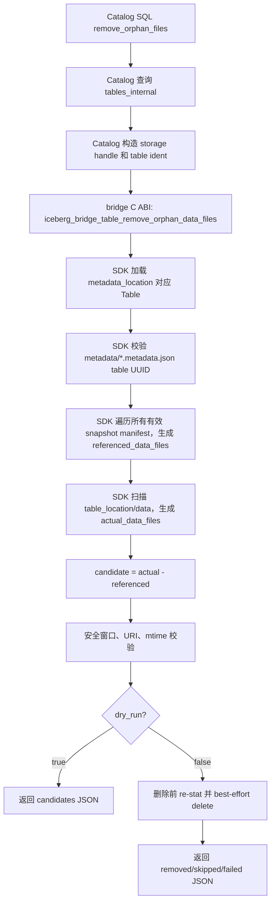
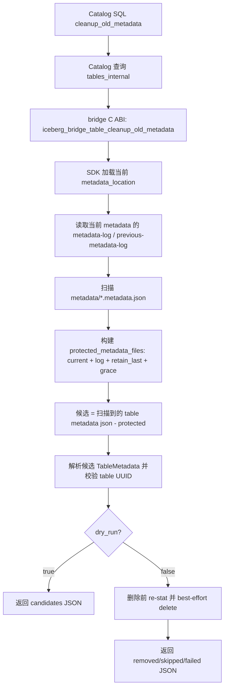
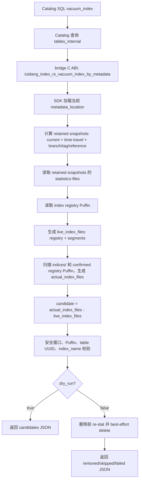

# Iceberg GC 第一阶段：目录扫描型维护接口设计

## 1. 背景

openGauss Iceberg 集成通过 `iceberg_catalog.tables_internal.metadata_location` 管理 Iceberg 表的当前
metadata pointer。FDW 只负责查询和扫描，不参与表维护命令。GC / 维护入口统一放在
`iceberg_catalog` 扩展中，由 Catalog SQL 函数同步调用 bridge C ABI，再由 bridge 调用 Rust SDK。

第一阶段只解决“不需要改写 Iceberg metadata.json”的清理问题：

- 写入任务失败、取消或进程崩溃后，可能留下未被任何 Iceberg metadata 引用的 data/delete 文件。
- 多次提交会积累旧 table metadata json；这些文件不能混在 data orphan cleanup 中处理。
- drop/rebuild index 只应更新索引 registry，不能立即物理删除历史查询仍可能依赖的 index registry / segment 文件。

第一阶段接口全部是目录扫描型维护动作。它们不会生成新的 Iceberg metadata，不会更新
`tables_internal.metadata_location`，也不会执行 Catalog CAS。

Iceberg 原生维护中，`expire_snapshots` 用于过期 snapshot 并删除只被过期 snapshot 独占引用的 data/delete、
manifest、manifest-list、statistics 文件；`remove_orphan_files` 用于清理不被 metadata 引用的孤儿文件，且官方提醒
retention 过短会误删尚未提交的写入文件。LanceDB OSS 倾向于用 `optimize()` 组合 compaction、cleanup 和索引维护。
本项目采用 Iceberg 的独立动作语义，并把组合入口留到第二阶段 Catalog orchestration 中设计。

## 2. 接口规格、约束与设计边界

### 2.1 对外 SQL 接口规格

| 接口 | 参数 | 类型 / 默认值 | 含义 | 返回 |
| --- | --- | --- | --- | --- |
| `remove_orphan_files` | `p_namespace` | `text`，必填 | Catalog namespace | `jsonb` |
|  | `p_table` | `text`，必填 | Catalog table name |  |
|  | `older_than` | `interval DEFAULT interval '7 days'` | 候选文件 mtime 必须早于 `now - older_than` |  |
|  | `dry_run` | `boolean DEFAULT true` | true 只返回候选；false 执行删除 |  |
|  | `verbose` | `boolean DEFAULT false` | true 返回候选、删除、跳过明细 |  |
| `cleanup_old_metadata` | `p_namespace` | `text`，必填 | Catalog namespace | `jsonb` |
|  | `p_table` | `text`，必填 | Catalog table name |  |
|  | `older_than` | `interval DEFAULT interval '7 days'` | 候选 metadata json mtime 必须早于安全窗口 |  |
|  | `retain_last` | `integer DEFAULT 100` | 除 current/log 保护外，额外保留最近 N 个 table metadata json；必须为正整数 |  |
|  | `dry_run` | `boolean DEFAULT true` | true 只返回候选；false 执行删除 |  |
|  | `verbose` | `boolean DEFAULT false` | true 返回明细 |  |
| `vacuum_index` | `p_namespace` | `text`，必填 | Catalog namespace | `jsonb` |
|  | `p_table` | `text`，必填 | Catalog table name |  |
|  | `index_name` | `text DEFAULT NULL` | NULL 表示清理全表索引；非 NULL 时只清理可证明属于该 index 的文件 |  |
|  | `older_than` | `interval DEFAULT interval '7 days'` | 候选 index 文件 mtime 必须早于安全窗口 |  |
|  | `dry_run` | `boolean DEFAULT true` | true 只返回候选；false 执行删除 |  |
|  | `verbose` | `boolean DEFAULT false` | true 返回明细 |  |

所有接口使用 `p_namespace` / `p_table` 定位 `iceberg_catalog.tables_internal` 记录，不要求调用方传 `regclass`。

### 2.2 对外行为约束

- 默认 `dry_run=true`。
- 默认安全窗口为 7 天。
- 调用是同步的；本阶段不新增维护任务表、维护队列或后台 scheduler。
- 请求级错误抛 SQL ERROR 或 C ABI error；文件级删除失败保存在返回 JSON 的 `failed` 中。
- 未配置 S3 或对象存储时，相关集成测试可以跳过，但本地 FileIO 回归必须可一键运行。

### 2.3 用户定义约束

用户和 Catalog 建表逻辑必须保证：

- 不同 Iceberg 表的 `table_location` 不能完全相同。
- 不同 Iceberg 表的 `table_location` 不能存在父子包含关系。
- 表的 storage config 必须能同时被扫描、维护和索引 SDK 正确解析。

当前实现如果尚未在 `create_table` 阶段强制校验 table_location 唯一性，也必须在维护入口通过 table UUID 和路径规则 fail closed，不能猜测删除。

### 2.4 内部实现约束

- 第一阶段不得修改 `tables_internal.metadata_location`。
- 第一阶段不得写新的 Iceberg table metadata json。
- bridge 只做 C ABI 参数转换和错误映射；核心清理算法放在 `iceberg-index` SDK。
- 删除前必须重新 `stat` 候选文件并复查安全窗口。
- mtime 缺失、路径越界、URI 无法规范化、table UUID 不匹配、Puffin 归属不明时不得删除。
- NotFound 按幂等成功处理，但明细中记录 `reason=not_found`。
- 所有路径比较必须解析 URI 后分别比较 scheme、authority/bucket 和 normalized path，不能只做字符串前缀匹配。

### 2.5 删除范围约束

| 文件类型 | 第一阶段处理接口 | 说明 |
| --- | --- | --- |
| `data/` 下未被任何有效 snapshot 引用的 data/delete 文件 | `remove_orphan_files` | 只处理 `{table_location}/data/` |
| 旧 table metadata json | `cleanup_old_metadata` | 只处理 `{table_location}/metadata/*.metadata.json` |
| index registry Puffin / index segment artifact | `vacuum_index` | 保护 retained snapshot / reference 可达索引 |
| manifest / manifest-list | 不在第一阶段处理 | 由第二阶段 `expire_snapshots` 的 `old_refs - new_refs` 删除；普通 orphan 扫描不碰 |
| Iceberg 原生 statistics Puffin | 不在第一阶段处理 | 由第二阶段 `expire_snapshots` 在确认新 metadata 不再引用后删除 |

manifest 和 manifest-list 的清理归属：Iceberg 原生 `expire_snapshots` 会报告并删除过期 snapshot 独占引用的 manifest
和 manifest-list；本项目也把这类文件放到第二阶段 `delete_expired_snapshot_files` 中处理。第一阶段不扫描 metadata
目录下的 manifest 或 manifest-list，以避免误删仍被 rollback、time travel、并发读或未发布 metadata 使用的文件。

### 2.6 Iceberg / LanceDB 对比

| 能力 | Iceberg 原生行为 | LanceDB 行为 | 本项目第一阶段 |
| --- | --- | --- | --- |
| orphan 文件清理 | `remove_orphan_files` 清理不被 metadata 引用且超过 retention 的文件；retention 过短有误删风险 | `optimize()` 的 cleanup 会清理旧版本文件 | 独立 `remove_orphan_files`，只扫 `data/`，默认 7 天 |
| 旧 metadata json | 可用 `write.metadata.delete-after-commit.enabled` 和 `write.metadata.previous-versions-max` 控制；未跟踪 metadata 也可被 orphan deletion 清理 | 旧版本由 cleanup/optimize 清理 | 独立 `cleanup_old_metadata`，默认 `retain_last=100`，用户可传参 |
| manifest / manifest-list | `expire_snapshots` 删除不再被有效 snapshot 引用的 manifest / manifest-list | cleanup 由 optimize 组合完成 | 第一阶段不清理，第二阶段处理 |
| index 文件 | Iceberg 无本项目自定义 index registry / segment | optimize 会组合索引维护 | 独立 `vacuum_index`，保护历史 snapshot 查询 |
| 组合入口 | Spark procedures 多为独立动作 | `optimize()` 是组合入口 | 放到第二阶段 Catalog 组合入口中 |

## 3. 术语

- `metadata_location`：Catalog 记录的当前 Iceberg metadata json URI，是本项目唯一的表状态入口。
- `table_location`：Iceberg table root URI。
- `安全窗口`：文件最后修改时间必须早于 `now - older_than`；默认 7 天。
- `protected set`：必须保留的文件集合，例如 current metadata、metadata log、最近 `retain_last` 个 metadata json。
- `live set`：仍被有效表状态引用的文件集合，通常用于 index vacuum；`live_index_files` 表示 retained snapshot / reference 可达 registry 中仍引用的 index 文件。
- `actual set`：对象存储目录扫描得到的实际文件集合。
- `candidate set`：`actual set - protected/live set` 后得到的候选集合，仍必须经过安全窗口和归属校验。
- `retained snapshot`：不会被过期或仍需支持 time travel / branch / tag / reference 查询的 snapshot。
- `unknown metadata json`：扫描 `{table_location}/metadata/` 后发现、且不在 `protected_metadata_files` 中的 `*.metadata.json` 文件。它可能是旧版本、失败写出的未发布 metadata、其他表误放文件或损坏文件，必须解析并校验 table UUID 后才能进入候选集合。
- `fail closed`：无法证明安全时拒绝或跳过，不猜测删除。

## 4. 具体使用场景

### 4.1 remove_orphan_files 场景

表 `db.events` 当前 metadata 为 `metadata/v0005.metadata.json`，当前和历史有效 snapshots 引用：

```text
s3://lake/db/events/data/2026-06-01/a.parquet
s3://lake/db/events/data/2026-06-02/b.parquet
s3://lake/db/events/data/delete/d1.parquet
```

对象存储实际文件：

```text
s3://lake/db/events/data/2026-06-01/a.parquet          # referenced, keep
s3://lake/db/events/data/2026-06-02/b.parquet          # referenced, keep
s3://lake/db/events/data/delete/d1.parquet             # referenced delete file, keep
s3://lake/db/events/data/tmp/job-1.parquet             # unreferenced, mtime 10 days ago, delete
s3://lake/db/events/data/tmp/job-2.parquet             # unreferenced, mtime 2 hours ago, skip
s3://lake/db/events/metadata/v0003.metadata.json       # not in data/, ignore
s3://lake/db/events/indices/idx-1/seg-1.puffin         # not in data/, ignore
```

调用：

```sql
SELECT iceberg_catalog.remove_orphan_files(
    p_namespace => 'db',
    p_table => 'events',
    older_than => interval '7 days',
    dry_run => false,
    verbose => true
);
```

结果边界：

- 删除 `data/tmp/job-1.parquet`。
- 跳过 `data/tmp/job-2.parquet`，原因是安全窗口内。
- 保留所有 referenced files。
- 不处理 metadata 和 indices 目录。

返回示例：

```json
{
  "operation": "remove_orphan_files",
  "dry_run": false,
  "scope": "data_files_only",
  "table": "db.events",
  "base_metadata_location": "s3://lake/db/events/metadata/v0005.metadata.json",
  "new_metadata_location": null,
  "candidate_file_count": 1,
  "deleted_file_count": 1,
  "skipped_file_count": 1,
  "failed_file_count": 0,
  "removed": [
    {"path": "s3://lake/db/events/data/tmp/job-1.parquet", "size": 1024}
  ],
  "skipped": [
    {"path": "s3://lake/db/events/data/tmp/job-2.parquet", "reason": "within_grace_period"}
  ],
  "failed": []
}
```

### 4.2 cleanup_old_metadata 场景

当前 metadata 为 `v0005.metadata.json`。metadata log 保护 `v0004.metadata.json` 和 `v0003.metadata.json`。
调用方传 `retain_last => 2`，因此最近两个版本 `v0005`、`v0004` 也受保护。

对象存储实际文件：

```text
metadata/v0005.metadata.json       # current, keep
metadata/v0004.metadata.json       # metadata log + retain_last, keep
metadata/v0003.metadata.json       # metadata log, keep
metadata/v0002.metadata.json       # old, UUID matches, mtime 20 days ago, delete
metadata/v0001.metadata.json       # old, mtime 1 day ago, skip
metadata/failed-write.metadata.json # not protected, parse fails, skip
metadata/manifest-list-1.avro       # not table metadata json, ignore
```

调用：

```sql
SELECT iceberg_catalog.cleanup_old_metadata(
    p_namespace => 'db',
    p_table => 'events',
    older_than => interval '7 days',
    retain_last => 2,
    dry_run => false,
    verbose => true
);
```

返回示例：

```json
{
  "operation": "cleanup_old_metadata",
  "dry_run": false,
  "scope": "table_metadata_json_only",
  "retain_last": 2,
  "candidate_file_count": 1,
  "deleted_file_count": 1,
  "skipped_file_count": 2,
  "removed": [
    {"path": "s3://lake/db/events/metadata/v0002.metadata.json", "size": 4096}
  ],
  "skipped": [
    {"path": "s3://lake/db/events/metadata/v0001.metadata.json", "reason": "within_grace_period"},
    {"path": "s3://lake/db/events/metadata/failed-write.metadata.json", "reason": "metadata_parse_failed"}
  ],
  "failed": []
}
```

### 4.3 vacuum_index 场景

当前 retained snapshots 为 `1003`、`1004`，它们的 statistics-files 指向 registry：

```text
indices/index-metadata-1003-live.puffin
indices/index-metadata-1004-live.puffin
```

registry 中 live segment：

```text
indices/vec_idx/snap1003/seg-a.puffin
indices/vec_idx/snap1004/seg-b.puffin
```

对象存储实际文件：

```text
indices/index-metadata-1004-live.puffin       # live registry, keep
indices/vec_idx/snap1004/seg-b.puffin         # live segment, keep
indices/vec_idx/dropped/seg-old.puffin        # not live, mtime 30 days ago, delete
indices/vec_idx/building/seg-new.puffin       # not live, mtime 1 hour ago, skip
indices/other_idx/orphan.puffin               # index_name=vec_idx 时归属不明或不匹配, skip
```

调用：

```sql
SELECT iceberg_catalog.vacuum_index(
    p_namespace => 'db',
    p_table => 'events',
    index_name => 'vec_idx',
    older_than => interval '7 days',
    dry_run => false,
    verbose => true
);
```

返回示例：

```json
{
  "operation": "vacuum_index",
  "dry_run": false,
  "scope": "index_files",
  "index_name": "vec_idx",
  "live_file_count": 4,
  "actual_file_count": 5,
  "candidate_file_count": 1,
  "deleted_file_count": 1,
  "skipped_file_count": 2,
  "removed": [
    {"path": "s3://lake/db/events/indices/vec_idx/dropped/seg-old.puffin", "size": 8192}
  ],
  "skipped": [
    {"path": "s3://lake/db/events/indices/vec_idx/building/seg-new.puffin", "reason": "within_grace_period"},
    {"path": "s3://lake/db/events/indices/other_idx/orphan.puffin", "reason": "index_name_mismatch_or_unknown_owner"}
  ],
  "failed": []
}
```

## 5. 端到端链路

### 5.1 remove_orphan_files 流程



该接口的 protected 依据来自当前 metadata 中所有有效 snapshots 的 manifest 引用集合。它只扫描 `data/`。

### 5.2 cleanup_old_metadata 流程



metadata log / previous metadata log 从当前 `metadata_location` 指向的 Iceberg `TableMetadata` 内容中读取；不是从
Catalog 表读取。

### 5.3 vacuum_index 流程



retained snapshot 的作用不是“生成 registry”，而是确定哪些历史 snapshot 仍可被查询或回滚。SDK 需要读取这些 snapshot
可达的 registry，从 registry 中标记必须保留的 registry Puffin 和 segment artifact，形成 `live_index_files`。

## 6. 接口与实现细节

### 6.1 remove_orphan_files

bridge C ABI：

```c
IcebergBridgeStatus iceberg_bridge_table_remove_orphan_data_files(
    IcebergBridgeStorage *storage,
    const char *metadata_location,
    const IcebergBridgeTableIdent *table_ident,
    bool dry_run,
    uint64_t grace_period_seconds,
    IcebergBridgeString **out,
    IcebergBridgeError **err);
```

SDK 接口：

```rust
pub struct MetadataRemoveOrphanFilesRequest {
    pub table_namespace: Vec<String>,
    pub table_name: String,
    pub metadata_location: String,
    pub dry_run: bool,
    pub grace_period_seconds: u64,
    pub file_io_config_json: String,
}

impl IndexEngine {
    pub fn remove_orphan_files_by_metadata(
        &self,
        req: &MetadataRemoveOrphanFilesRequest,
    ) -> Result<String>;
}
```

实现要求：

- 收集所有有效 snapshot 引用的 data/delete files。
- 只扫描 `{table_location}/data/`。
- `actual - referenced` 后再做安全窗口和 URI 校验。
- 不重新加载最新 metadata；依赖 7 天安全窗口和删除前 re-stat 保护并发写入。

### 6.2 cleanup_old_metadata

bridge C ABI：

```c
IcebergBridgeStatus iceberg_bridge_table_cleanup_old_metadata(
    IcebergBridgeStorage *storage,
    const char *metadata_location,
    const IcebergBridgeTableIdent *table_ident,
    uint64_t retain_last,
    bool dry_run,
    uint64_t grace_period_seconds,
    IcebergBridgeString **out,
    IcebergBridgeError **err);
```

SDK 接口：

```rust
pub struct MetadataCleanupOldMetadataRequest {
    pub table_namespace: Vec<String>,
    pub table_name: String,
    pub metadata_location: String,
    pub retain_last: u64,
    pub dry_run: bool,
    pub grace_period_seconds: u64,
    pub file_io_config_json: String,
}

impl IndexEngine {
    pub fn cleanup_old_metadata_by_metadata(
        &self,
        req: &MetadataCleanupOldMetadataRequest,
    ) -> Result<String>;
}
```

实现要求：

- 从当前 `TableMetadata` 读取 metadata log / previous metadata log。
- 扫描 `{table_location}/metadata/*.metadata.json`。
- 构建 `protected_metadata_files = current + metadata log + previous metadata log + retain_last + grace_window`。
- “待确认 metadata json”指扫描到但不在 `protected_metadata_files` 中的 metadata json。
- 待确认 metadata json 必须解析为 Iceberg `TableMetadata` 并校验 `table-uuid`。
- 只删除 table metadata json，不删除 manifest、manifest-list、Puffin、data/delete files。

### 6.3 vacuum_index

bridge C ABI：

```c
IcebergBridgeStatus iceberg_index_rs_vacuum_index_by_metadata(
    IcebergBridgeStorage *storage,
    const IcebergIndexVacuumByMetadataRequest *request,
    IcebergBridgeString **out,
    IcebergBridgeError **err);
```

SDK 接口：

```rust
pub struct MetadataVacuumIndexRequest {
    pub table_namespace: Vec<String>,
    pub table_name: String,
    pub metadata_location: String,
    pub index_name: Option<String>,
    pub dry_run: bool,
    pub grace_period_seconds: u64,
    pub file_io_config_json: String,
}

impl IndexEngine {
    pub fn vacuum_index_by_metadata(
        &self,
        req: &MetadataVacuumIndexRequest,
    ) -> Result<String>;
}
```

实现要求：

- retained snapshots 用于确定 `live_index_files`。
- 从 retained snapshots 的 `statistics-files.statistics_path` 找到 registry Puffin。
- registry Puffin 必须包含本项目 index registry blob type，且 table UUID 匹配。
- `live_index_files` 包含 registry Puffin 自身和 registry 中所有 live segment artifact。
- `actual_index_files` 来自 `{table_location}/indices/` 和 confirmed registry Puffin。
- `candidate_index_files = actual_index_files - live_index_files`。
- candidate 必须再经过安全窗口、Puffin sanity、table UUID 和 `index_name` 校验。

## 7. 返回 JSON 规范

独立接口统一返回：

```json
{
  "operation": "remove_orphan_files",
  "dry_run": true,
  "scope": "data_files_only",
  "table": "db.events",
  "table_uuid": "...",
  "base_metadata_location": "...",
  "new_metadata_location": null,
  "current_snapshot_id": 123,
  "grace_period_seconds": 604800,
  "candidate_file_count": 1,
  "candidate_bytes": 1024,
  "deleted_file_count": 0,
  "deleted_bytes": 0,
  "skipped_file_count": 0,
  "failed_file_count": 0,
  "candidates": [],
  "removed": [],
  "skipped": [],
  "failed": []
}
```

字段规则：

- `new_metadata_location` 第一阶段固定为 `null`。
- `failed` 始终返回。
- `candidates`、`removed`、`skipped` 仅在 `verbose=true` 或测试模式下返回完整明细。
- 文件级失败不回滚已完成删除。

## 8. 测试计划

- 本地 FileIO 回归覆盖三个接口的 dry-run 和 execute。
- S3 集成测试通过环境变量显式开启，未配置时跳过。
- 所有接口覆盖默认 7 天安全窗口。
- `remove_orphan_files` 覆盖 referenced、old orphan、new orphan、metadata/indices 目录忽略。
- `cleanup_old_metadata` 覆盖 current、metadata log、`retain_last`、安全窗口、解析失败、UUID 不匹配。
- `vacuum_index` 覆盖 retained snapshot 保护、branch/tag/reference 保护、`index_name` 过滤、Puffin sanity check。
- NotFound 删除按幂等成功断言。
- 路径越界、URI normalize 失败、mtime 缺失必须进入 skipped 或请求级错误。

## 9. 开发清单

### 9.1 SDK

- 在 `iceberg-index` 实现三个 metadata-location request 和同步入口。
- 核心逻辑放在 `iceberg-index-iceberg`，bridge-facing API 放在 `iceberg-index-abi`。
- 返回 JSON 字段必须与本文一致。

### 9.2 bridge

- 暴露三个 C ABI。
- bridge 不保留目录扫描或删除算法。
- bridge 只做参数转换、storage config 传递、错误映射和 JSON 字符串返回。

### 9.3 Catalog

- 暴露三个 SQL 函数。
- 从 `tables_internal` 查询表。
- 构造 bridge storage handle。
- 返回 jsonb。
- 不新增维护任务表或队列。
