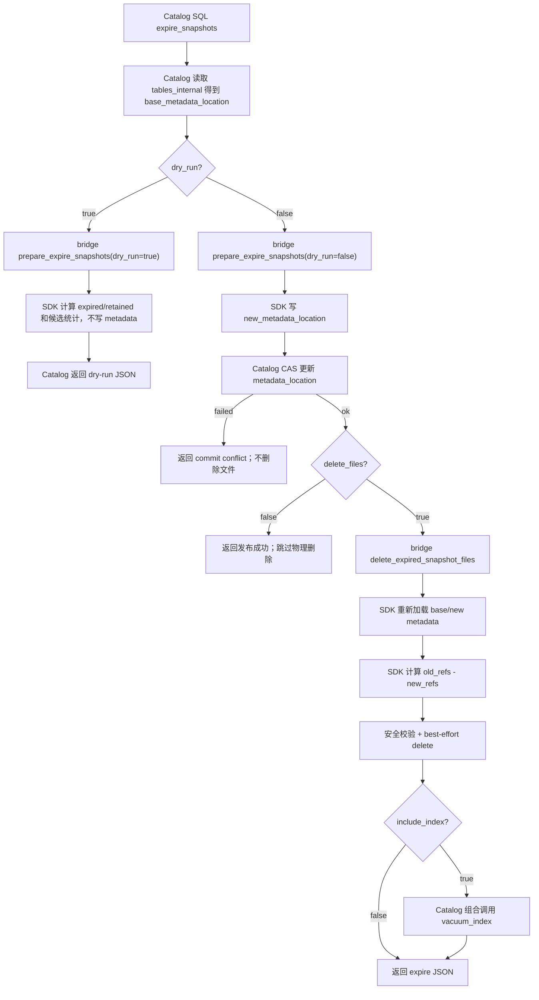

# Iceberg GC 第二阶段：expire_snapshots 元数据重写与 CAS 发布设计

## 1. 背景

Iceberg 每次写入、删除、更新、compaction 或索引 registry 发布都会产生新的表版本和相关元数据。历史 snapshot
用于 snapshot isolation、time travel 和 rollback，但长期不清理会积累旧 data/delete files、manifest、manifest-list、
statistics Puffin 和 metadata json。

第二阶段实现 `expire_snapshots`。它与第一阶段目录扫描型维护不同：它会生成新的 Iceberg table metadata json，并且必须由
openGauss Catalog 使用 CAS 发布新的 `metadata_location`。物理删除只能发生在 CAS 成功之后。

Iceberg 原生 `expire_snapshots` 会删除旧 snapshot，并删除不再被未过期 snapshot 需要的文件，包括 data/delete files、
manifest files、manifest-list files 和 statistics files。Spark procedure 中 `retain_last` 默认 1，并保护 branch/tag
引用的 snapshots。本项目沿用这些语义，但把 metadata pointer 发布拆到 openGauss Catalog 中完成。

## 2. 接口规格、约束与设计边界

### 2.1 对外 SQL 接口规格

```sql
SELECT iceberg_catalog.expire_snapshots(
    p_namespace text,
    p_table text,
    older_than interval DEFAULT interval '7 days',
    retain_last integer DEFAULT 1,
    snapshot_ids bigint[] DEFAULT NULL,
    dry_run boolean DEFAULT true,
    delete_files boolean DEFAULT true,
    include_index boolean DEFAULT false,
    verbose boolean DEFAULT false
);
```

| 参数 | 类型 / 默认值 | 含义 |
| --- | --- | --- |
| `p_namespace` | `text`，必填 | Catalog namespace |
| `p_table` | `text`，必填 | Catalog table name |
| `older_than` | `interval DEFAULT interval '7 days'` | 早于 `now - older_than` 的 snapshot 可作为过期候选 |
| `retain_last` | `integer DEFAULT 1` | 沿 current snapshot 祖先链至少保留最近 N 个 snapshots；必须为正整数 |
| `snapshot_ids` | `bigint[] DEFAULT NULL` | 显式指定过期候选；仍必须经过 current/reference 保护 |
| `dry_run` | `boolean DEFAULT true` | true 只计算；false 执行 prepare、CAS 和可选删除 |
| `delete_files` | `boolean DEFAULT true` | CAS 成功后是否删除过期 snapshot 独占引用的物理文件 |
| `include_index` | `boolean DEFAULT false` | expire 成功后，Catalog 是否组合调用 `vacuum_index` |
| `verbose` | `boolean DEFAULT false` | 是否返回候选/删除/跳过明细 |

返回类型：`jsonb`。

### 2.2 对外行为约束

- 默认 `dry_run=true`。
- `dry_run=true` 不写 metadata，不 CAS，不删除物理文件。
- `dry_run=false` 必须执行三段式：prepare -> Catalog CAS -> delete-after-CAS。
- `delete_files=false` 只发布新 metadata，不删除物理文件。
- `include_index=true` 只在 Catalog 层组合调用 `vacuum_index`，不得把 index 文件删除混入 SDK 的
  `expire_snapshots`。

### 2.3 内部实现约束

- Catalog 是唯一能更新 `tables_internal.metadata_location` 的组件。
- bridge / SDK 不读写 `tables_internal`，不直接提交 REST Catalog。
- prepare 阶段返回的删除候选只用于展示、审计和预估，不能作为删除授权。
- delete-after-CAS 必须重新加载 base/new metadata，并重新计算 `old_refs - new_refs`。
- CAS 失败不得删除物理文件。
- CAS 成功后不因后续文件级删除失败回滚 metadata pointer。

### 2.4 删除范围约束

可删除文件必须来自 `old_refs - new_refs`：

- data files。
- position delete files。
- equality delete files。
- manifest files。
- manifest-list files。
- Iceberg 原生 statistics Puffin。

不得删除：

- new metadata 仍引用的文件。
- 当前 snapshot 或 retained snapshot 仍引用的文件。
- branch/tag/reference 可达 snapshot 仍引用的文件。
- index registry Puffin。
- index segment artifact。
- 文件类型或 table 归属无法确认的文件。

### 2.5 Iceberg / LanceDB 对比

| 能力 | Iceberg 原生行为 | LanceDB 行为 | 本项目第二阶段 |
| --- | --- | --- | --- |
| snapshot 过期 | `expire_snapshots` 删除旧 snapshot 及其独占文件；`retain_last` 默认 1；branch/tag 保护 snapshot | `optimize()` cleanup 清理超过 retention 的旧版本；tagged versions 受保护 | 独立 `expire_snapshots`，由 Catalog CAS 发布新 metadata |
| manifest / manifest-list | expire snapshot 输出包含 deleted manifest / manifest-list counts | 由 optimize/cleanup 组合处理 | delete-after-CAS 重新计算 `old_refs - new_refs` 后删除 |
| orphan 文件 | 独立 `remove_orphan_files` | cleanup 常由 optimize 组合 | 不在 `expire_snapshots` 中扫描 orphan；交给第一阶段 |
| 旧 metadata json | writer 属性可自动删除 tracked old metadata；untracked metadata 可由 orphan deletion 清理 | cleanup 清理旧版本 | 不隐式清理全部旧 metadata json；可由 Catalog 组合 `cleanup_old_metadata` |
| index 文件 | Iceberg 原生无本项目 index artifact | optimize 会组合索引更新 | 不直接删除 index；Catalog 可组合 `vacuum_index` |

## 3. 术语

- `base_metadata_location`：Catalog 在本次调用开始时读取到的当前 metadata pointer。
- `new_metadata_location`：SDK prepare 阶段写出的候选新 metadata json。
- `final_metadata_location`：本次调用结束时 Catalog 表中实际记录的 metadata pointer。
- `retained snapshot`：必须保留的 snapshot，包括 current、`retain_last` 保护、branch/tag/reference 可达 snapshot。
- `expired snapshot`：满足策略且不在 retained set 中的 snapshot。
- `old_refs`：base metadata 中引用的可物理删除类型文件集合。
- `new_refs`：new metadata 中仍引用的可物理删除类型文件集合。
- `delete candidates`：`old_refs - new_refs`。
- `CAS`：带 `WHERE metadata_location = base_metadata_location` 的条件更新，用于防止并发覆盖。

## 4. 具体使用场景

### 4.1 dry-run 场景

表 `db.events` 有 snapshots：

```text
1001  created_at=2026-05-01  references data/a.parquet, manifests/m1.avro, snap-1001.avro
1002  created_at=2026-05-10  references data/b.parquet, manifests/m2.avro, snap-1002.avro
1003  created_at=2026-06-20  references data/c.parquet, manifests/m3.avro, snap-1003.avro  # current
```

调用：

```sql
SELECT iceberg_catalog.expire_snapshots(
    p_namespace => 'db',
    p_table => 'events',
    older_than => interval '30 days',
    retain_last => 1,
    dry_run => true,
    verbose => true
);
```

预期：

- `1001`、`1002` 是 expired candidates。
- `1003` 是 retained。
- 不写新 metadata。
- 不删除 `data/a.parquet`、`manifests/m1.avro`、`metadata/snap-1001.avro`。

返回示例：

```json
{
  "operation": "expire_snapshots",
  "dry_run": true,
  "base_metadata_location": "s3://lake/db/events/metadata/v0003.metadata.json",
  "new_metadata_location": null,
  "expired_snapshot_ids": [1001, 1002],
  "retained_snapshot_ids": [1003],
  "candidate_file_count": 6,
  "deleted_file_count": 0,
  "steps": {
    "prepare": {"status": "ok"},
    "catalog_cas": {"status": "skipped"},
    "delete_files": {"status": "skipped"}
  },
  "failed": []
}
```

### 4.2 execute + delete_files 场景

base metadata 引用：

```text
data/a.parquet                 # only snapshot 1001
data/b.parquet                 # snapshot 1002 and 1003 both reference, keep
data/c.parquet                 # current snapshot 1003, keep
metadata/snap-1001.avro         # only snapshot 1001
metadata/manifests/m1.avro      # only snapshot 1001
metadata/manifests/m2.avro      # still referenced by 1003, keep
metadata/statistics-1001.puffin # only expired snapshot, delete if Iceberg statistics Puffin
indices/vec_idx/seg-old.puffin  # index artifact, never delete here
```

调用：

```sql
SELECT iceberg_catalog.expire_snapshots(
    p_namespace => 'db',
    p_table => 'events',
    older_than => interval '30 days',
    retain_last => 1,
    dry_run => false,
    delete_files => true,
    verbose => true
);
```

预期：

- prepare 写出 `v0004.metadata.json`。
- Catalog CAS 把 `metadata_location` 从 `v0003` 更新到 `v0004`。
- delete-after-CAS 删除 `data/a.parquet`、`snap-1001.avro`、`m1.avro`、`statistics-1001.puffin`。
- 保留 `data/b.parquet`、`m2.avro`、`indices/vec_idx/seg-old.puffin`。

返回示例：

```json
{
  "operation": "expire_snapshots",
  "dry_run": false,
  "base_metadata_location": "s3://lake/db/events/metadata/v0003.metadata.json",
  "new_metadata_location": "s3://lake/db/events/metadata/v0004.metadata.json",
  "final_metadata_location": "s3://lake/db/events/metadata/v0004.metadata.json",
  "expired_snapshot_ids": [1001],
  "retained_snapshot_ids": [1002, 1003],
  "deleted_data_files_count": 1,
  "deleted_manifest_files_count": 1,
  "deleted_manifest_lists_count": 1,
  "deleted_statistics_files_count": 1,
  "deleted_file_count": 4,
  "skipped_file_count": 1,
  "skipped": [
    {"path": "s3://lake/db/events/indices/vec_idx/seg-old.puffin", "reason": "index_file_not_managed_by_expire_snapshots"}
  ],
  "failed": [],
  "steps": {
    "prepare": {"status": "ok"},
    "catalog_cas": {"status": "ok"},
    "delete_files": {"status": "ok"}
  }
}
```

### 4.3 CAS 失败场景

如果 prepare 之后，另一个事务已经把 Catalog metadata pointer 从 `v0003` 更新到 `v0005`，本次 CAS：

```sql
WHERE metadata_location = '.../v0003.metadata.json'
```

更新 0 行。此时：

- 不调用 delete-after-CAS。
- 不删除任何物理文件。
- prepare 写出的未发布 `v0004.metadata.json` 留待第一阶段 `cleanup_old_metadata` 在安全窗口后处理。

### 4.4 delete_files=false 场景

`delete_files=false` 时：

- prepare 和 CAS 正常执行。
- 不删除 data/delete、manifest、manifest-list、statistics 文件。
- 返回 `steps.delete_files.status="skipped"`。

### 4.5 include_index=true 场景

`include_index=true` 时：

- `expire_snapshots` 成功后，Catalog 组合调用 `vacuum_index`。
- `expire_snapshots` 自身仍不删除 index registry / segment。
- `vacuum_index` 的结果放入组合入口 step JSON。

## 5. 端到端链路



## 6. 接口与实现细节

### 6.1 Catalog SQL 实现

SQL 入口：

`sql
SELECT iceberg_catalog.expire_snapshots(
    p_namespace text,
    p_table text,
    older_than interval DEFAULT interval '7 days',
    retain_last integer DEFAULT 1,
    snapshot_ids bigint[] DEFAULT NULL,
    dry_run boolean DEFAULT true,
    delete_files boolean DEFAULT true,
    include_index boolean DEFAULT false,
    verbose boolean DEFAULT false
) RETURNS jsonb;
`

Catalog 是该接口的编排者，处理顺序必须固定：

1. 校验 p_namespace、p_table 非空，older_than 大于 0，
etain_last > 0。
2. 从 `iceberg_catalog.tables_internal` 按 namespace/table 读取当前表记录，得到 base_metadata_location、`table_uuid`、`table_location`、current_snapshot_id。
3. 打开 bridge storage handle，并构造 table ident。
4. 调用 bridge iceberg_bridge_table_prepare_expire_snapshots。
5. 如果 dry_run=true：
   - prepare 只返回 expired/retained 摘要和候选统计。
   - Catalog 不执行 CAS，不调用 delete-after-CAS，不调用
acuum_index。
   - 直接把 prepare JSON 转成 jsonb 返回。
6. 如果 dry_run=false 且 prepare 返回 no-op：
   - Catalog 不执行 CAS。
   - 不删除物理文件。
   - 返回 no-op JSON。
7. 如果 dry_run=false 且 prepare 返回
ew_metadata_location：
   - 在同一 SQL 事务中执行 CAS：WHERE metadata_location = base_metadata_location。
   - CAS 更新行数必须为 1。
   - CAS 更新 0 行表示并发提交冲突，返回 request-level error，不调用 delete-after-CAS。
8. CAS 成功后：
   - delete_files=false 时跳过物理删除。
   - delete_files=true 时调用 bridge iceberg_bridge_table_delete_expired_snapshot_files，传入 base_metadata_location 和
ew_metadata_location。
9. 如果 include_index=true 且 expire step 已成功发布或 no-op 成功，Catalog 再组合调用
acuum_index；该调用属于组合 step，不改变 expire_snapshots 的底层删除范围。
10. 汇总 prepare、CAS、delete-files、可选 vacuum-index 的结果并返回 jsonb。

Catalog 不做：

- 不直接解析 manifest、manifest-list 或 Puffin。
- 不直接删除对象存储文件。
- 不把 prepare 返回的候选文件列表作为删除授权。

### 6.2 prepare_expire_snapshots

bridge C ABI：

```c
IcebergBridgeStatus iceberg_bridge_table_prepare_expire_snapshots(
    IcebergBridgeStorage *storage,
    const IcebergPrepareExpireSnapshotsRequest *request,
    IcebergBridgeString **out,
    IcebergBridgeError **err);
```

SDK 接口：

```rust
pub struct MetadataPrepareExpireSnapshotsRequest {
    pub table_namespace: Vec<String>,
    pub table_name: String,
    pub base_metadata_location: String,
    pub older_than_ms: Option<i64>,
    pub retain_last: u32,
    pub snapshot_ids: Option<Vec<i64>>,
    pub dry_run: bool,
    pub file_io_config_json: String,
}

impl IndexEngine {
    pub fn prepare_expire_snapshots_by_metadata(
        &self,
        req: &MetadataPrepareExpireSnapshotsRequest,
    ) -> Result<String>;
}
```

实现要求：

- `retain_last == 0` 返回 invalid input。
- 当前 snapshot 永远保留。
- current snapshot 祖先链最近 `retain_last` 个 snapshots 保留。
- branch/tag/reference 可达 snapshots 保留。
- 满足 `older_than` 或 `snapshot_ids` 且不在 retained set 的 snapshots 进入 expired set。
- dry-run 不写 new metadata。
- execute 写 new metadata，但不发布 pointer。
- expired set 为空时返回 no-op，Catalog 不执行 CAS。

### 6.3 Catalog CAS

CAS SQL 必须等价于：

```sql
UPDATE `iceberg_catalog.tables_internal`
   SET metadata_location = $new_metadata_location,
       current_snapshot_id = $new_current_snapshot_id
 WHERE namespace = $namespace
   AND table_name = $table_name
   AND metadata_location = $base_metadata_location;
```

约束：

- 更新行数必须为 1。
- 更新 0 行是并发提交冲突。
- CAS 失败不删除物理文件。
- CAS 失败留下的未发布 metadata 由 `cleanup_old_metadata` 后续清理。

### 6.4 delete_expired_snapshot_files

bridge C ABI：

```c
IcebergBridgeStatus iceberg_bridge_table_delete_expired_snapshot_files(
    IcebergBridgeStorage *storage,
    const IcebergDeleteExpiredSnapshotFilesRequest *request,
    IcebergBridgeString **out,
    IcebergBridgeError **err);
```

SDK 接口：

```rust
pub struct MetadataDeleteExpiredSnapshotFilesRequest {
    pub table_namespace: Vec<String>,
    pub table_name: String,
    pub base_metadata_location: String,
    pub new_metadata_location: String,
    pub grace_period_seconds: u64,
    pub file_io_config_json: String,
}

impl IndexEngine {
    pub fn delete_expired_snapshot_files_by_metadata(
        &self,
        req: &MetadataDeleteExpiredSnapshotFilesRequest,
    ) -> Result<String>;
}
```

实现要求：

- 重新加载 base metadata。
- 重新加载 new metadata。
- 校验 table UUID 一致。
- 计算 `old_refs` 和 `new_refs`。
- `delete_candidates = old_refs - new_refs`。
- 只删除可确认文件类型和 table 归属的候选。
- 删除前 re-stat 并检查安全窗口。
- NotFound 幂等成功。

## 7. 返回 JSON 规范

```json
{
  "operation": "expire_snapshots",
  "dry_run": false,
  "table": "db.events",
  "table_uuid": "...",
  "base_metadata_location": "...",
  "new_metadata_location": "...",
  "final_metadata_location": "...",
  "expired_snapshot_ids": [1001],
  "retained_snapshot_ids": [1002, 1003],
  "candidate_file_count": 4,
  "deleted_data_files_count": 1,
  "deleted_position_delete_files_count": 0,
  "deleted_equality_delete_files_count": 0,
  "deleted_manifest_files_count": 1,
  "deleted_manifest_lists_count": 1,
  "deleted_statistics_files_count": 1,
  "deleted_file_count": 4,
  "skipped_file_count": 0,
  "failed_file_count": 0,
  "failed": [],
  "steps": {
    "prepare": {"status": "ok"},
    "catalog_cas": {"status": "ok"},
    "delete_files": {"status": "ok"}
  }
}
```

## 8. Catalog 组合入口

组合入口属于最终 Catalog 层功能，放在第二阶段设计中：

```sql
SELECT iceberg_catalog.gc_table(
    p_namespace text,
    p_table text,
    expire_snapshots boolean DEFAULT true,
    remove_orphan_files boolean DEFAULT true,
    cleanup_old_metadata boolean DEFAULT false,
    vacuum_index boolean DEFAULT false,
    older_than interval DEFAULT interval '7 days',
    retain_last integer DEFAULT 1,
    metadata_retain_last integer DEFAULT 100,
    dry_run boolean DEFAULT true,
    verbose boolean DEFAULT false
);
```

组合入口只编排独立接口，不新增 bridge / SDK 组合 ABI。推荐顺序：

```text
expire_snapshots -> remove_orphan_files -> cleanup_old_metadata -> vacuum_index
```

状态值：

- `ok`
- `partial_failure`
- `request_error`
- `skipped`
- `skipped_due_to_failed_step`

`gc_table` 中 `retain_last` 传给 `expire_snapshots`，`metadata_retain_last` 传给 `cleanup_old_metadata`，避免两个接口的
保留语义混淆。

## 9. 测试计划

- 构造至少 3 个 snapshots。
- 覆盖 `retain_last=1`、`retain_last=3`、显式 `snapshot_ids`。
- 覆盖 branch/tag/reference 保护。
- dry-run 不写 metadata、不 CAS、不删除。
- execute 成功执行 prepare、CAS、delete-after-CAS。
- CAS 失败不删除物理文件。
- delete-after-CAS 重新计算 `old_refs - new_refs`。
- `delete_files=false` 跳过物理删除。
- `include_index=true` 只触发 Catalog 组合 `vacuum_index`。
- 验证 manifest、manifest-list、statistics Puffin 由 expire snapshot 删除。
- 验证 index registry / segment 不由 expire snapshot 删除。
- 覆盖 S3 URI normalize、bucket/authority 比较、mtime、NotFound 幂等。

## 10. 开发清单

### 10.1 SDK

- 实现 `prepare_expire_snapshots_by_metadata`。
- 实现 `delete_expired_snapshot_files_by_metadata`。
- 实现 snapshot 策略计算。
- 实现 base/new metadata 引用差集。
- 实现路径、UUID、文件类型和安全窗口保护。

### 10.2 bridge

- 暴露 prepare C ABI。
- 暴露 delete-after-CAS C ABI。
- 映射 SDK 错误到 bridge status。
- 不实现 Catalog CAS。

### 10.3 Catalog

- 暴露 `expire_snapshots` SQL。
- 查询 `tables_internal`。
- 调 prepare。
- 执行 CAS。
- CAS 成功后按 `delete_files` 调 delete-after-CAS。
- 按 `include_index` 组合调用 `vacuum_index`。
